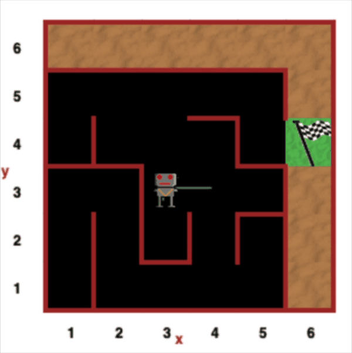

# Day 06 – Reborg's World
This project is part of my Python learning journey.

## About
Solved challenges in **Reborg's World** using Python to practice:
- Functions
- Loops
- Conditional statements

## Demo


## Files
```text
day06_reborgs_world/
├── main.py
└── README.md
```

## How to Run
This code runs inside the **Reborg's World** online environment.  
Copy the code from `main.py` and paste it into Reborg’s editor.
## Learning Outcome
Improved problem-solving and logical thinking using Python.