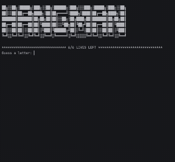

# Day 07 – Hangman 🎯

This project is part of my Python learning journey.

## About
A command-line **Hangman game** built using Python where the player guesses letters to reveal a hidden word.

## Demo 🎥


## Concepts Practised
- Loops
- Conditional statements
- Lists and strings
- User input handling
- ASCII art for UI improvement

## Files
```

day07_hangman/  
├── main.py  
├── hangman_art.py  
├── hangman_words.py  
├── hangman_demo.gif  
└── README.md

````

## How to Run
Run the game using:
```bash
python main.py
````

## Learning Outcome

Improved logical thinking, game flow design, and user interaction in Python.