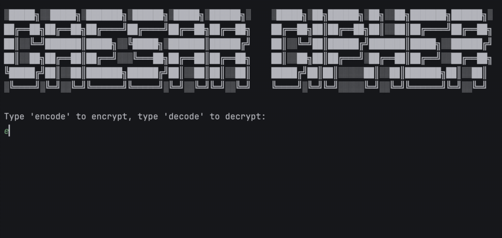

# Day 08 – Caesar Cipher 🔐

A simple Python program to **encode and decode messages** using the Caesar Cipher technique.

## Demo 🎥


## Concepts Practised
- Functions
- Loops
- Conditional statements
- Lists and indexing
- Modulo operator

## Files
```

day08_caesar_cipher/  
├── main.py  
├── art.py  
├── demo.gif 
└── README.md


````

## How to Run
```bash
python main.py
````

## Learning Outcome

Practised basic encryption logic and user input handling in Python.