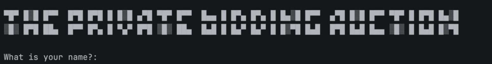

# Day 09 – Secret Auction 💰

A Python program that simulates a **secret auction**, where multiple users can place bids anonymously and the highest bidder wins.

## Demo 🎥


## Concepts Practised
- Dictionaries
- While loops
- Conditional statements
- Functions
- User input handling

## Files
```

day09_secret_auction/  
├── art.py  
├── demo.gif  
├── main.py  
└── README.md

````

## How to Run
```bash
python main.py
````

## Learning Outcome

Learnt how to store dynamic data using dictionaries and determine results using logic.
